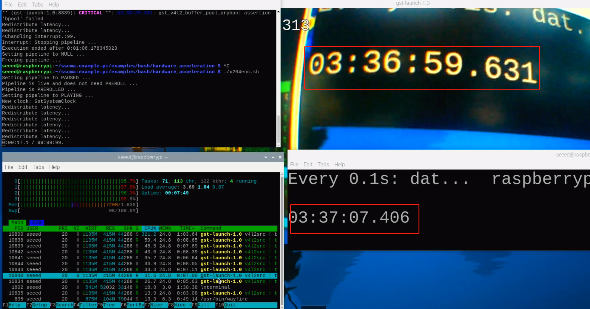

## Hardware Acceleration
### configure gpu memory
```bash
sudo raspi-config
```
  select 7.Advanced Options -> A3.Memory Split -> 256 -> Finish

If there is no gpu memory option in raspi-config, you can comment it out in /boot/config.txt
```bash
gpu_mem=256
```

check gpu memory
```bash
vcgencmd get_mem gpu
```

### H264 Hardware Acceleration element
1. v4l2h264enc: V4L2 H.264 Encoder, GStreamer will use v4l2h264enc for hardware video encode, which is part of gstreamer1.0-plugins-good.
2. x264enc: x264 H.264 Encoder, it is software encode
3. omxh264enc: libav OpenMAX IL H.264 video encoder encoder, anything mentioning "omx" or "il" is referencing OpenMax IL, which is deprecated, and not available on a 64bit OS.

[rerference](https://www.raspberrypi.com/documentation/computers/camera_software.html#the-libcamerasrc-element)

### preformance
1. v4l2src directly output h264 stream, then use v4l2h264dec to decode h264 stream(v4l2src.sh)
```bash
gst-launch-1.0 v4l2src ! video/x-h264,width=1280,height=720,framerate=30/1 ! h264parse config-interval=1 ! queue ! v4l2h264dec ! v4l2convert ! xvimagesink sync=false 
```
cpu usage: about 50%
video delay: about 1 second


2. v4l2src output yuv stream, then use x264enc to encode h264 stream, then use avdec_h264 to decode h264 stream(x264enc.sh)
```bash
gst-launch-1.0 v4l2src ! timeoverlay ! videoconvert ! videoscale ! video/x-raw,width=1280,height=720,framerate=30/1,format=YVYU ! videoconvert ! queue ! x264enc ! h264parse config-interval=1 ! avdec_h264 ! videoconvert ! xvimagesink sync=false  
```
cpu usage: more than 100%
video delay: more than 8 seconds


3. v4l2src output yuv stream, then use v4l2h264enc to encode h264 stream, then use v4l2h264dec to decode h264 stream(v4l2enc.sh)
```bash
gst-launch-1.0 v4l2src ! timeoverlay  ! v4l2convert ! videoscale ! video/x-raw,width=1280,height=720,framerate=30/1,format=YVYU ! v4l2convert ! queue ! v4l2h264enc ! 'video/x-h264,level=(string)4.2' ! h264parse config-interval=1 ! v4l2h264dec ! v4l2convert ! xvimagesink sync=false  
```
cpu usage: about 70%
video delay: less than 1 second
