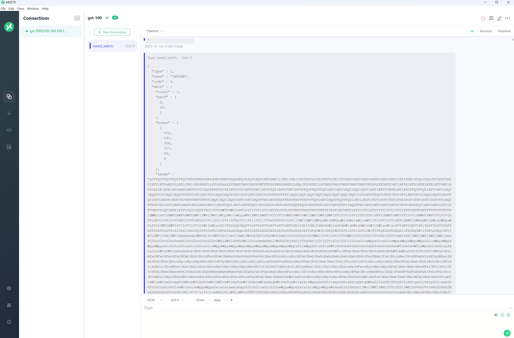

# MQTT sink

## Dependencies
1. mosquitto
2. libpaho-mqtt-dev
3. nnstreamer-misc [nnstreamer-misc](https://nnstreamer.github.io/tutorial3_pubsub_mqtt.html)

## steps
1. run mosquitto
```bash
mosquitto -v
```

2. run the mqtt sink
```bash
./run.sh
```

3. see the result in mqtt client
  you can use any mqtt client to subscribe the topic "sscma_yolov5", and you will see the result in json format.

## Description
mqttsink is a plugin of nnsreamer, in order to work with another plugin mqttsrc, it adds some fields on the basis of json format, and these fields may not be needed by you. You can download the [source code](https://github.com/nnstreamer/nnstreamer), modify this plugin, remove the fields you don't need, and then recompile it to replace the original plugin. You can refer to [here](./mqttsink.diff).

## Result
