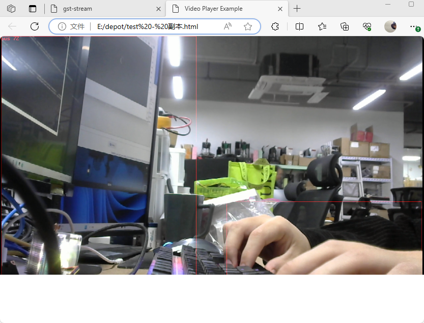

## web access is used locally
    1. open http server

    ```bash
    python3 -m http.server 8000
    ```
    2. open gstreamer pipeline

    ```bash
    ./run.sh
    ```
    3. open browser (client.html)

## Remote access using the web side
    1. open http server

    ```bash
    python3 http_server.py
    ```
    2. open gstreamer pipeline

    ```bash
    ./run.sh
    ```
    3. open browser (client.html)
    Change the http://localhost:8000 to your server ip address

    ```bash
    <source src="http://localhost:8000/playlist.m3u8" type="application/x-mpegURL" />
    ```

## result 
