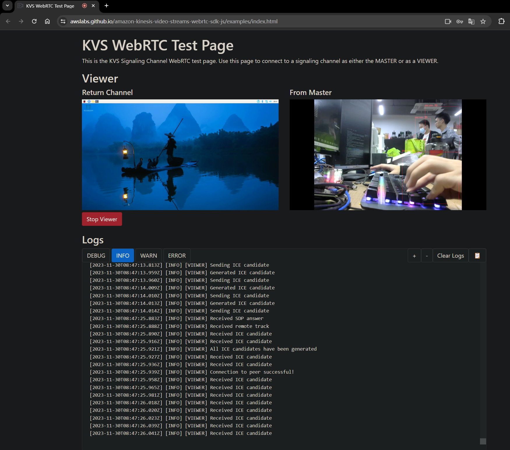

# Using the AWS KVS signaller
## Dependencies
1. rust toolchain
2. libssl-dev
3. libnice-dev [reference](https://github.com/libnice/libnice)
  (particular , you need to make sure libgstnice.so is in your GST_PLUGIN_PATH)


## steps
1. Setup AWS Kinesis Video Streams
    1. Create a Kinesis Video Stream from the AWS console (<https://us-west-2.console.aws.amazon.com/kinesisvideo/home?region=us-west-2#/signalingChannels/create>)
    2. Create a access key for your AWS account (<https://console.aws.amazon.com/iam/home?#/security_credentials>)
    
2. Run the example
Edit the `run.sh` script to include your AWS credentials and the name of the Kinesis Video Stream you created in step 1. Then run the script.
```bash
echo "export GST_PLUGIN_PATH=<path-to-gst-plugins-rs>/target/debug:$GST_PLUGIN_PATH" >> ~/.bashrc
source ~/.bashrc
./run.sh
```
3. View the stream
Connect a viewer @ <https://awslabs.github.io/amazon-kinesis-video-streams-webrtc-sdk-js/examples/index.html>

## Results

