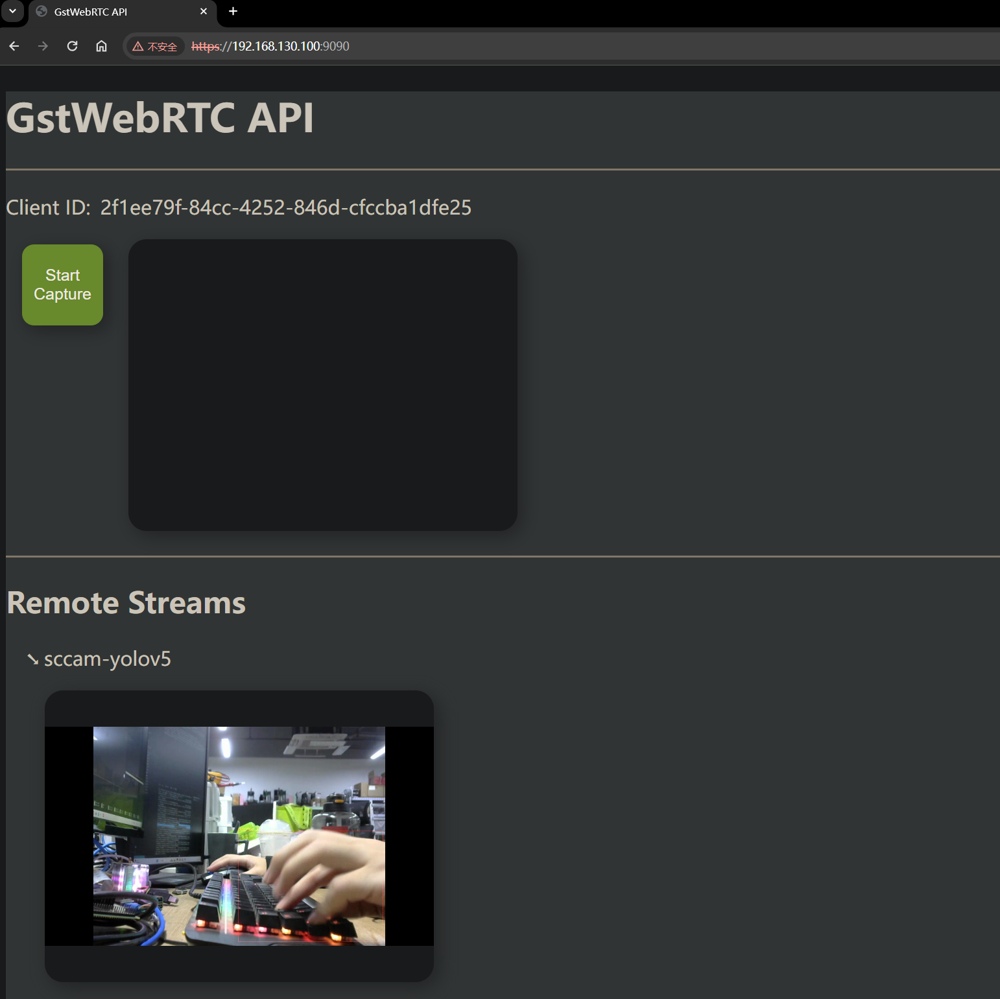

# webRTC sink

## Dependencies
1. rust toolchain
2. nodejs, npm
3. libssl-dev
4. libnice-dev [reference](https://github.com/libnice/libnice)
  (particular , you need to make sure libgstnice.so is in your GST_PLUGIN_PATH)


## steps
1. download and install gst-plugin-webrtc
```bash
git clone https://gitlab.freedesktop.org/gstreamer/gst-plugins-rs
cd gst-plugins-rs
cargo install cargo-c
cargo cbuild -p gst-plugin-webrtc
cargo cbuild -p gst-plugin-rtp
GST_PLUGIN_PATH="target/aarch64-unknown-linux-gnu/debug:$GST_PLUGIN_PATH" gst-inspect-1.0 webrtcsink
```

2. open a terminal and run the signaling server
```bash
cd gst-plugins-rs/net/webrtc/signaling
WEBRTCSINK_SIGNALLING_SERVER_LOG=debug cargo run --bin gst-webrtc-signalling-server
```

3. open another terminal and run the webrtc sink
```bash
cd gst-plugins-rs/net/webrtc/gstwebrtc-api
npm install
npm start
```

4. open another terminal and run the webrtc source
```bash
echo "export GST_PLUGIN_PATH=<path-to-gst-plugins-rs>/target/debug:$GST_PLUGIN_PATH" >> ~/.bashrc
source ~/.bashrc
./run.sh
```

## Results
